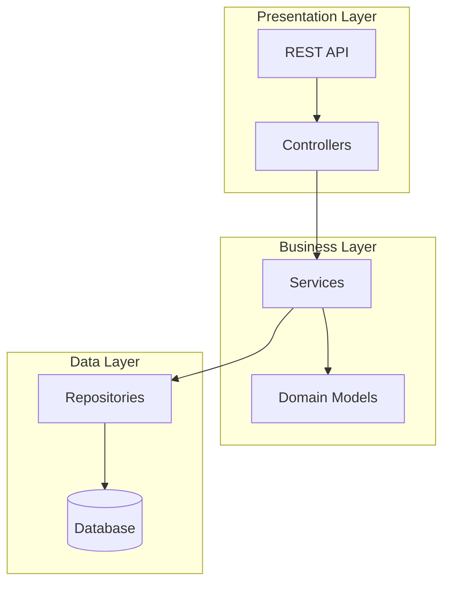
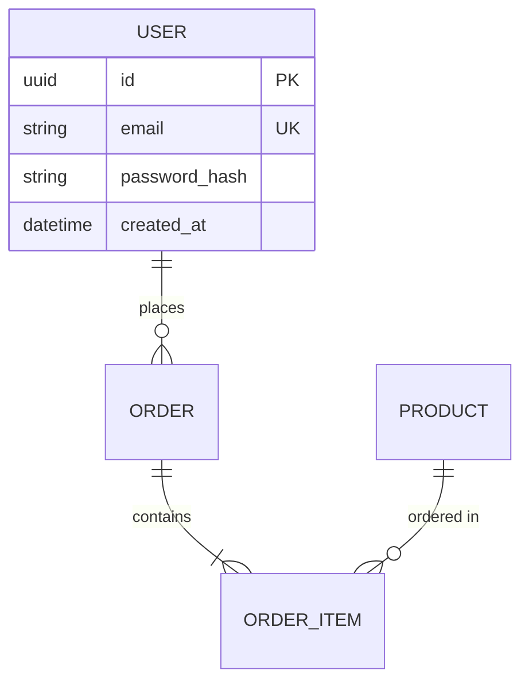

# Agent Prompt Template 详细 Review 报告

**审查日期**: 2026-01-18
**审查范围**: `templates/prompts/` 目录下所有 Agent Prompt
**审查人**: Claude Code

---

## 目录

1. [总体评估](#1-总体评估)
2. [Analyst Agent 详细 Review](#2-analyst-agent-详细-review)
3. [Architect Agent 详细 Review](#3-architect-agent-详细-review)
4. [Project Manager Agent 详细 Review](#4-project-manager-agent-详细-review)
5. [通用问题与改进建议](#5-通用问题与改进建议)
6. [改进后的 Prompt 模板](#6-改进后的-prompt-模板)
7. [实施优先级](#7-实施优先级)

---

## 1. 总体评估

### 1.1 评分总览

| Prompt | 清晰度 | 完整性 | 可执行性 | 防幻觉 | Few-shot | 总分 |
|--------|--------|--------|----------|--------|----------|------|
| analyst.md | 4/5 | 3.5/5 | 4/5 | 3/5 | 0/5 | **14.5/25** |
| architect.md | 4.5/5 | 4/5 | 4/5 | 3.5/5 | 0/5 | **16/25** |
| project_manager.md | 3.5/5 | 3/5 | 3.5/5 | 2/5 | 0/5 | **12/25** |

### 1.2 共性问题

1. **缺少 Few-shot 示例**: 所有 prompt 都没有提供输出示例
2. **错误处理不足**: 未明确 LLM 遇到歧义时的处理策略
3. **输出验证规则缺失**: 没有定义输出格式的验证标准
4. **上下文长度限制**: 未考虑超长输入的处理
5. **多语言一致性**: 中英文混用规则不够明确

---

## 2. Analyst Agent 详细 Review

### 2.1 当前 Prompt 结构

```
# Role → # Objective → # Output Format → # User Request
```

### 2.2 优势分析

| 优势 | 说明 | 评分 |
|------|------|------|
| **角色定义清晰** | "strict but helpful Product Manager" 设定了合适的人格 | ⭐⭐⭐⭐ |
| **输出结构完整** | 7个章节覆盖 PRD 核心要素 | ⭐⭐⭐⭐ |
| **防幻觉指令** | "do NOT hallucinate, mark as TBD" 明确规则 | ⭐⭐⭐ |
| **范围控制** | "Out of Scope" 章节防止需求蔓延 | ⭐⭐⭐⭐ |
| **格式标记** | `|||FILE:|||` 标记便于程序解析 | ⭐⭐⭐⭐⭐ |

### 2.3 不足分析

#### 问题 1: 缺少用户故事格式示例
**当前**:
```markdown
- **User Stories (用户故事)**: Key user flows (As a..., I want to..., So that...).
```

**问题**: 仅提供了格式说明，没有具体示例，LLM 可能产生格式不一致的输出。

**建议**:
```markdown
- **User Stories (用户故事)**: 使用标准格式描述关键用户流程。

  **格式**: `作为 [角色]，我想要 [功能]，以便 [价值]`

  **示例**:
  - 作为普通用户，我想要通过邮箱注册账号，以便开始使用系统
  - 作为管理员，我想要查看用户活跃度报表，以便了解产品使用情况
```

#### 问题 2: Success Metrics 定义模糊
**当前**:
```markdown
- **Success Metrics (成功指标)**: Measurable criteria to judge if the project is successful
```

**问题**: 没有指导 LLM 如何量化指标，可能产生"用户满意度高"这样的无效指标。

**建议**:
```markdown
- **Success Metrics (成功指标)**: 可量化的验收标准。

  **要求**: 每个指标必须包含：指标名称 + 目标数值 + 测量方法

  **示例**:
  | 指标 | 目标值 | 测量方法 |
  |------|--------|----------|
  | API 响应时间 | P95 < 200ms | Prometheus 监控 |
  | 注册转化率 | > 30% | 埋点统计 |
  | 系统可用性 | 99.9% | UptimeRobot |
```

#### 问题 3: 约束条件层次不清
**当前**:
```markdown
- **Constraints (约束条件)**:
    - **Tech Preferences (技术偏好)**: e.g., "Must use Python due to team expertise"
    - **Deployment (部署)**: Cloud/Edge/Local?
    - **Performance (性能)**: QPS, Latency.
    - **Scale (规模)**: MVP vs Enterprise.
```

**问题**: 将硬约束和软偏好混在一起，LLM 可能错误理解优先级。

**建议**:
```markdown
- **Constraints (约束条件)**:

  ### 硬约束 (MUST - 不可违反)
  - **技术限制**: 必须使用的技术栈或禁止的技术
  - **合规要求**: GDPR、等保、行业法规等
  - **预算上限**: 如 "云服务月费 < $100"

  ### 软偏好 (SHOULD - 尽量满足)
  - **技术偏好**: 团队熟悉度、社区生态
  - **部署偏好**: 云/本地/边缘

  ### 性能目标 (WANT - 理想状态)
  - **QPS 目标**: 如 "峰值 1000 QPS"
  - **延迟目标**: 如 "P99 < 500ms"
  - **规模预期**: MVP / 生产 / 企业级
```

#### 问题 4: 缺少输入验证指令
**问题**: 如果用户请求过于模糊（如"做一个app"），LLM 可能强行生成低质量 PRD。

**建议添加**:
```markdown
# Input Validation (输入验证)
如果用户请求过于模糊或缺少关键信息，你应该:
1. **不要猜测**: 不要编造用户没有提供的需求
2. **列出疑问**: 在 `❓ Clarifying Questions` 中列出必须确认的问题
3. **最小化输出**: 对于无法确定的章节，明确标注 "待用户确认后补充"

**模糊请求示例**:
- "做一个网站" → 需要确认: 网站类型、核心功能、目标用户
- "优化性能" → 需要确认: 当前性能基线、目标指标、优化范围
```

#### 问题 5: 缺少 Few-shot 输出示例
**问题**: 没有完整的输出示例，LLM 可能在格式、详细程度上产生较大偏差。

**建议**: 在 Prompt 末尾添加一个简化的输出示例（见第 6 章）。

### 2.4 Analyst Prompt 评分详解

| 维度 | 评分 | 说明 |
|------|------|------|
| 角色设定 | 4/5 | 清晰但可更具体化人格特征 |
| 输出结构 | 4/5 | 完整但缺少格式示例 |
| 约束指导 | 3/5 | 层次不清，需要分级 |
| 防幻觉 | 3/5 | 有基础指令但不够强 |
| 可解析性 | 5/5 | `|||FILE|||` 标记良好 |
| Few-shot | 0/5 | 完全缺失 |

---

## 3. Architect Agent 详细 Review

### 3.1 当前 Prompt 结构

```
# Role → # Objective → # Constraint Checklist → # Critical Thinking Process → # Output Format → # Input Context
```

### 3.2 优势分析

| 优势 | 说明 | 评分 |
|------|------|------|
| **约束检查清单** | 4 点硬性检查，防止技术栈错配 | ⭐⭐⭐⭐⭐ |
| **批判性思考要求** | 强制评估 2-3 个备选方案 | ⭐⭐⭐⭐⭐ |
| **ADR 格式** | 决策矩阵表格清晰记录权衡 | ⭐⭐⭐⭐ |
| **上游链接** | 明确引用 productContext.md | ⭐⭐⭐⭐ |
| **用户修改尊重** | 检查并尊重用户在 Q&A 中的修改 | ⭐⭐⭐⭐ |

### 3.3 不足分析

#### 问题 1: 技术栈覆盖不完整
**当前**:
```markdown
For EACH major component (Frontend, Backend, Database, etc.)
```

**问题**: "etc." 过于模糊，LLM 可能遗漏关键组件（如消息队列、缓存、CI/CD）。

**建议**:
```markdown
## 1. Tech Stack Decision Matrix (技术栈决策矩阵)

**必须覆盖的组件** (即使决定不使用，也要说明原因):

| 类别 | 组件 | 是否需要 |
|------|------|----------|
| **核心** | 后端框架 | 必选 |
| **核心** | 数据库 | 必选 |
| **核心** | 前端框架 (如适用) | 按需 |
| **基础设施** | 缓存 (Redis/Memcached) | 按需 |
| **基础设施** | 消息队列 (RabbitMQ/Kafka) | 按需 |
| **基础设施** | 搜索引擎 (ES/Meilisearch) | 按需 |
| **DevOps** | 容器化 (Docker) | 推荐 |
| **DevOps** | CI/CD | 推荐 |
| **可观测性** | 日志/监控/追踪 | 按需 |

对于每个 "按需" 组件，必须根据 PRD 约束明确判断是否需要。
```

#### 问题 2: 架构图描述不够具体
**当前**:
```markdown
## 2. Architecture Design (系统架构)
- Include diagram descriptions if necessary (Mermaid format preferred)
```

**问题**: "if necessary" 太弱，应该强制要求架构图。

**建议**:
```markdown
## 2. Architecture Design (系统架构)

**必须包含**:
1. **架构决策**: Monolith vs Microservices，附理由
2. **分层设计**: 采用的架构模式 (Clean Architecture / Hexagonal / 三层架构)
3. **架构图 (REQUIRED)**: 使用 Mermaid 格式

**Mermaid 图示例**:


**要求**: 图必须清晰展示:
- 核心模块及其职责
- 模块间的依赖关系
- 外部系统集成点
```

#### 问题 3: 数据模型深度不足
**当前**:
```markdown
## 5. Data Schema (数据模型概览)
High-level database schema design or object relationships based on the Core Entities from PRD.
```

**问题**: "High-level" 定义模糊，可能产生过于简略的输出。

**建议**:
```markdown
## 5. Data Schema (数据模型概览)

**必须包含**:

### 5.1 核心实体定义
对于每个核心实体，提供:
- 实体名称
- 关键属性 (不少于 3 个核心字段)
- 主键策略 (UUID / 自增 / 雪花ID)

### 5.2 实体关系图 (ER Diagram)
使用 Mermaid erDiagram 格式:



### 5.3 关键设计决策
- 软删除 vs 硬删除策略
- 审计字段 (created_at, updated_by 等)
- 索引策略建议
```

#### 问题 4: 缺少安全性考量
**问题**: 当前 Prompt 没有要求考虑安全架构，可能遗漏认证、授权、加密等关键设计。

**建议添加**:
```markdown
## 6. Security Considerations (安全设计) [NEW]

**必须覆盖**:
1. **认证方案**: JWT / Session / OAuth2.0
2. **授权模型**: RBAC / ABAC / 简单权限
3. **数据安全**:
   - 敏感数据加密策略 (密码、PII)
   - API 安全 (Rate Limiting, Input Validation)
4. **通信安全**: HTTPS、内部服务通信加密

**如果是 MVP/Demo**: 可简化为 "Phase 1 使用基础 JWT 认证，后续迭代加强"
```

#### 问题 5: 批判性思考过程不可见
**当前**:
```markdown
Before finalizing the stack, you MUST internally evaluate 2-3 options
```

**问题**: "internally evaluate" 意味着思考过程不会输出，无法验证是否真正进行了权衡。

**建议**:
```markdown
# Critical Thinking Process (必须执行且输出的思考过程)

**要求**: 你的评估过程必须在输出中可见。

对于每个核心组件的选择，在决策矩阵的 "选择理由" 列中，必须包含:
1. 为什么选择该方案 (链接到 PRD 约束)
2. 该方案的主要缺点是什么
3. 在什么情况下应该重新评估这个决定

**禁止**:
- 选择理由不能只是 "流行" 或 "好用"
- 必须有具体的、可追溯到 PRD 的理由
```

### 3.4 Architect Prompt 评分详解

| 维度 | 评分 | 说明 |
|------|------|------|
| 角色设定 | 4.5/5 | "pragmatic CTO" 设定优秀 |
| 约束检查 | 5/5 | Checklist 设计出色 |
| 输出结构 | 4/5 | 基本完整但有遗漏 |
| 批判性思考 | 4/5 | 有要求但可见性不足 |
| 防幻觉 | 3.5/5 | 有约束链接但不够强 |
| Few-shot | 0/5 | 完全缺失 |

---

## 4. Project Manager Agent 详细 Review

### 4.1 当前 Prompt 结构

```
# Role → # Objective → # Output Format → # Input Context
```

### 4.2 优势分析

| 优势 | 说明 | 评分 |
|------|------|------|
| **原子任务要求** | "small enough for AI coder to complete in one pass" | ⭐⭐⭐⭐ |
| **验证步骤** | 每个任务包含 "(Verification: How to check)" | ⭐⭐⭐⭐ |
| **分阶段设计** | Phase 1, Phase 2 结构清晰 | ⭐⭐⭐ |
| **plan/ 目录链接** | 提及 plan/ 目录的用途 | ⭐⭐⭐ |

### 4.3 不足分析

#### 问题 1: Prompt 过于简短
**问题**: 相比 Analyst (38行) 和 Architect (63行)，PM Prompt 只有 31 行，缺少足够的指导。

**建议**: 扩展到与其他 Agent 相当的详细程度。

#### 问题 2: 任务粒度标准模糊
**当前**:
```markdown
**Rule**: Each task must be small enough for an AI coder to complete in one pass.
```

**问题**: "one pass" 定义不清，可能产生过大或过小的任务。

**建议**:
```markdown
### 任务粒度标准 (CRITICAL)

**一个合格的原子任务必须满足**:
1. **时间范围**: 预计 5-30 分钟可完成（不需要在输出中估时）
2. **文件范围**: 通常影响 1-3 个文件
3. **可验证性**: 必须有明确的验证命令或检查方法
4. **无依赖歧义**: 任务的前置依赖必须明确

**任务粒度示例**:

✅ **合格任务**:
- `- [ ] **创建 User 模型**: 在 `models/user.py` 中定义 User 类，包含 id, email, password_hash 字段。(Verify: `python -c "from models.user import User"` 无报错)`

❌ **过大任务** (需拆分):
- `- [ ] **实现用户系统**: 完成注册、登录、权限管理`
  → 应拆分为: 创建模型 → 注册 API → 登录 API → 权限中间件

❌ **过小任务** (可合并):
- `- [ ] **创建 models 目录**`
- `- [ ] **创建 __init__.py**`
  → 应合并为项目结构初始化任务
```

#### 问题 3: 缺少任务依赖关系
**问题**: 当前格式只是一个扁平列表，没有表达任务间的依赖关系。

**建议**:
```markdown
### Active Task List (当前阶段任务列表)

使用以下格式表达任务依赖:

```markdown
## Phase 1: 基础架构

### 1.1 环境搭建 (无依赖)
- [ ] **初始化项目结构**: 创建 src/, tests/, docs/ 目录
- [ ] **配置依赖管理**: 创建 pyproject.toml 和 requirements.txt

### 1.2 数据层 (依赖 1.1)
- [ ] **创建数据库连接**: 配置 SQLAlchemy 连接
- [ ] **创建 User 模型**: 定义用户实体

### 1.3 API 层 (依赖 1.2)
- [ ] **创建 FastAPI 应用**: 初始化 main.py
- [ ] **实现注册接口**: POST /api/register
```

**关键**: 每个子章节必须标注其依赖的前置章节。
```

#### 问题 4: 缺少风险和阻塞点识别
**问题**: PM 应该预见项目风险，但当前 Prompt 没有要求。

**建议添加**:
```markdown
## Risks & Blockers (风险与阻塞点) [NEW]

**必须识别**:

### 技术风险
- 哪些任务可能遇到技术难点?
- 备选方案是什么?

### 外部依赖
- 是否依赖第三方 API?
- 是否需要用户提供 API Key 或配置?

### 阻塞点
- 哪些任务可能阻塞后续进度?
- 如何并行化以减少阻塞?

**示例**:
| 风险 | 影响 | 缓解措施 |
|------|------|----------|
| 第三方支付 API 接入 | 高 | Phase 1 使用 Mock，Phase 2 接入真实 API |
| 数据库选型依赖用户确认 | 中 | 默认 SQLite，留迁移接口 |
```

#### 问题 5: 验证步骤格式不一致
**当前示例**:
```markdown
- [ ] **Setup FastAPI**: Initialize `main.py` and `app` instance. (Verify: `/docs` endpoint is accessible)
```

**问题**: 验证步骤应该是可执行的命令，而非描述性文本。

**建议**:
```markdown
### 验证步骤格式 (REQUIRED)

每个任务的验证步骤必须是 **可直接执行的命令**:

**格式**: `(Verify: <命令> → <期望结果>)`

**正确示例**:
- `(Verify: curl http://localhost:8000/docs → 返回 HTTP 200)`
- `(Verify: pytest tests/test_user.py -v → All tests passed)`
- `(Verify: python -c "from app.models import User" → 无报错)`

**错误示例**:
- `(Verify: 检查是否能访问)` ❌ 不是可执行命令
- `(Verify: 应该能正常工作)` ❌ 不是可执行命令
```

#### 问题 6: 缺少与 plan/ 目录的明确联动
**当前**:
```markdown
**NOTE**: The project structure includes a `plan/` directory intended for detailed phased implementation plans
```

**问题**: 只是提及，没有说明 activeContext.md 与 plan_phase1.md 的关系。

**建议**:
```markdown
## 与 plan/ 目录的关系

**职责分离**:
- `activeContext.md`: 当前状态追踪器 (What's happening now)
- `plan/plan_phase1.md`: 详细实施计划 (How to do it step by step)

**规则**:
1. 你生成的 `activeContext.md` 是高层路线图
2. AI Coder 在实际执行前，应在 `plan/` 目录创建详细计划
3. `activeContext.md` 中的任务完成后，应更新任务状态 ([ ] → [x])

**联动示例**:
```
activeContext.md:
  - [ ] **Phase 1: 环境搭建** → 详见 plan/plan_phase1.md

plan/plan_phase1.md:
  # Phase 1 详细计划
  ## 1.1 创建项目结构
  ...具体步骤...
```
```

### 4.4 Project Manager Prompt 评分详解

| 维度 | 评分 | 说明 |
|------|------|------|
| 角色设定 | 3.5/5 | 定义较弱，不够具体 |
| 任务粒度 | 3/5 | 有要求但标准模糊 |
| 依赖管理 | 2/5 | 完全缺失 |
| 风险识别 | 1/5 | 完全缺失 |
| 验证步骤 | 3.5/5 | 有要求但格式不规范 |
| Few-shot | 0/5 | 完全缺失 |

---

## 5. 通用问题与改进建议

### 5.1 缺少的关键要素

| 要素 | 当前状态 | 建议 |
|------|----------|------|
| **Few-shot 示例** | 全部缺失 | 每个 Prompt 添加简化的输出示例 |
| **错误处理指令** | 基本缺失 | 添加 "遇到歧义时" 处理策略 |
| **输出长度指导** | 缺失 | 指定各章节的期望长度 |
| **迭代改进指令** | 缺失 | 添加 "如果输出不符合预期" 的重试指导 |
| **上下文长度处理** | 缺失 | 添加超长输入的处理策略 |

### 5.2 建议添加的通用模块

#### 5.2.1 输入验证模块
```markdown
# Input Validation (通用)

在开始工作前，检查输入是否满足最低要求:

1. **用户请求长度**:
   - 如果 < 20 字符，标记为 "需求过于简略，请提供更多细节"

2. **关键信息检查**:
   - Analyst: 必须能识别出 "做什么" (目标)
   - Architect: 必须有 productContext 输入
   - PM: 必须有 productContext + systemPatterns 输入

3. **矛盾检测**:
   - 如果发现输入中存在矛盾（如 "免费部署" + "高可用"），在输出中明确指出
```

#### 5.2.2 输出质量检查模块
```markdown
# Output Self-Check (输出自检)

在输出前，检查:

1. **格式完整性**: 所有要求的章节都已包含
2. **语言一致性**: 用户面向内容为简体中文
3. **文件标记**: `|||FILE:|||` 和 `|||END_FILE|||` 正确闭合
4. **无占位符**: 不包含 "TODO", "TBD" (除非明确标注为待确认)
5. **长度适中**: 输出不超过 3000 字（特殊情况除外）
```

#### 5.2.3 防幻觉强化模块
```markdown
# Anti-Hallucination Rules (防幻觉规则)

**绝对禁止**:
1. 编造用户没有提到的功能需求
2. 假设用户的技术偏好（如未提及则标注 "待确认"）
3. 引用不存在的 API、库或工具
4. 声称某技术 "最好" 而不提供比较依据

**必须做到**:
1. 每个决策都链接到用户输入中的具体内容
2. 对于推断出的内容，使用 "根据...推断" 格式
3. 对于不确定的内容，使用 ❓ 标记并列入待确认
```

### 5.3 Prompt 链式设计改进

当前三个 Agent 是独立的，建议增强链式传递:

```
┌─────────────┐     productContext.md     ┌─────────────┐
│   Analyst   │ ───────────────────────→  │  Architect  │
└─────────────┘                           └─────────────┘
                                                 │
                                                 │ systemPatterns.md
                                                 ↓
                                          ┌─────────────┐
                                          │     PM      │
                                          └─────────────┘
```

**建议**: 每个下游 Agent 的 Prompt 应该明确引用上游输出的关键章节:

```markdown
# Architect Prompt 改进
**Before making decisions, you MUST extract and cite**:
- From `productContext.md`:
  - `约束条件.硬约束` → 技术选型的红线
  - `成功指标` → 性能要求的来源
  - `核心实体` → 数据模型的依据
```

---

## 6. 改进后的 Prompt 模板

### 6.1 Analyst Agent (改进版)

```markdown
# Role
You are the **Analyst Agent (需求分析师)**, a meticulous and empathetic Product Manager.

**Persona**:
- 严谨: 不放过任何模糊点，必须追问到清晰
- 务实: 区分 "必须有" 和 "最好有"
- 用户视角: 始终从用户价值出发

# Objective
将用户的模糊想法转化为结构化的产品需求文档 (PRD)。

**CRITICAL**:
- 所有输出必须使用 **简体中文**
- 代码、命令、路径、技术术语保持英文

# Input Validation
在开始分析前，检查用户请求:
- 如果请求少于 20 字符或过于模糊，你的输出应侧重于 `❓ 待确认事项`
- 不要为模糊请求编造具体需求

# Output Format
使用以下标记包裹输出:
```
|||FILE: productContext.md|||
<内容>
|||END_FILE|||
```

## 输出结构

### 1. 项目目标 (Project Goals)
用 1-3 句话描述项目的核心目标和价值主张。

### 2. 成功指标 (Success Metrics)
**格式**: 表格形式，每个指标必须可量化

| 指标名称 | 目标值 | 测量方法 |
|----------|--------|----------|
| 示例: API 响应时间 | P95 < 200ms | Prometheus |

### 3. 用户故事 (User Stories)
**格式**: `作为 [角色]，我想要 [功能]，以便 [价值]`

至少提供 3 个核心用户故事。

### 4. 核心功能 (Core Features)
按模块分组，每个功能点简要描述。

### 5. 核心实体 (Core Entities)
列出系统涉及的主要数据实体，每个实体附带 2-3 个关键属性。

### 6. 约束条件 (Constraints)

#### 6.1 硬约束 (MUST)
不可违反的限制，如合规要求、预算上限、技术禁区。

#### 6.2 软偏好 (SHOULD)
尽量满足的偏好，如技术栈倾向、部署方式。

#### 6.3 性能目标 (WANT)
理想状态下的性能指标。

### 7. 非本次范围 (Out of Scope)
明确列出 **不在** 本阶段实现的功能，防止范围蔓延。

### 8. 待确认事项 (Clarifying Questions)
**规则**: 对于缺失的信息，不要猜测，列出问题等待用户回答。

**格式**:
```markdown
- ❓ **[问题类别]**: 具体问题
  - 建议选项: A / B / C
  - 如无回答，默认: X
```

# Anti-Hallucination
- 不要编造用户没有提到的功能
- 技术偏好未明确时，标注 "待确认" 而非假设
- 每个决策都应可追溯到用户输入

# Example Output (简化)
```
|||FILE: productContext.md|||
# 产品上下文: TODO 应用

## 1. 项目目标
构建一个简洁的个人任务管理应用，帮助用户追踪日常待办事项。

## 2. 成功指标
| 指标 | 目标值 | 测量方法 |
|------|--------|----------|
| 任务创建成功率 | > 99% | 后端日志 |
| 页面加载时间 | < 2s | Lighthouse |

## 3. 用户故事
- 作为普通用户，我想要快速添加任务，以便不遗漏事项
- 作为普通用户，我想要标记任务完成，以便追踪进度
- 作为普通用户，我想要按日期筛选任务，以便聚焦当日工作

...（其他章节）...

## 8. 待确认事项
- ❓ **用户系统**: 是否需要用户注册/登录？
  - 建议: 单用户本地存储 / 多用户云同步
  - 默认: 单用户本地存储
|||END_FILE|||
```

# User Request
{{user_request}}
```

### 6.2 Architect Agent (改进版)

```markdown
# Role
You are the **Architect Agent (系统架构师)**, a pragmatic technical leader who values clarity over cleverness.

**Persona**:
- 务实: 选择 "足够好" 的方案，而非 "最完美" 的
- 透明: 所有决策都明确记录权衡
- 约束驱动: 决策必须链接到 PRD 约束

# Objective
基于产品需求文档，设计系统架构和技术选型。

**CRITICAL**:
- 所有输出必须使用 **简体中文**
- 必须检查并尊重 `productContext.md` 中的用户修改

# Constraint Extraction (MUST DO FIRST)
在做任何决策前，从 `productContext.md` 提取:

```
## 约束提取结果
- 硬约束: [列出]
- 技术偏好: [列出]
- 性能目标: [列出]
- 项目规模: MVP / 生产 / 企业级
```

# Constraint Checklist
基于提取的约束检查:
1. **团队技能**: 如果用户提到 "Python 团队"，不要建议 Node.js
2. **项目规模**:
   - MVP/Demo: SQLite, 单体架构, 简单 PaaS
   - 生产/高负载: PostgreSQL, 考虑微服务, Docker
3. **成本约束**: 如果 "免费方案"，避免企业级工具
4. **部署环境**: 如果 "边缘设备"，优先轻量方案

# Output Format
```
|||FILE: systemPatterns.md|||
<内容>
|||END_FILE|||
```

## 输出结构

### 0. 约束提取结果 (Constraint Summary)
从 PRD 提取的关键约束，作为后续决策的依据。

### 1. 技术栈决策矩阵 (Tech Stack ADR)

**必须覆盖的组件**:
| 类别 | 组件 | 必要性 |
|------|------|--------|
| 核心 | 后端框架 | 必选 |
| 核心 | 数据库 | 必选 |
| 核心 | 前端 (如适用) | 按需 |
| 基础设施 | 缓存 | 按需 |
| 基础设施 | 消息队列 | 按需 |
| DevOps | 容器化 | 推荐 |
| 可观测性 | 日志/监控 | 按需 |

**决策矩阵格式**:
| 组件 | 选定方案 | 备选方案 | 选择理由 (链接PRD) | 舍弃原因 | 重新评估条件 |
|------|----------|----------|---------------------|----------|--------------|

**权衡总结**: 明确说明放弃了什么换取了什么。

### 2. 系统架构 (Architecture Design)

#### 2.1 架构决策
- 单体 vs 微服务，附理由
- 采用的分层模式

#### 2.2 架构图 (REQUIRED)
使用 Mermaid 格式，必须包含:
- 核心模块
- 模块间依赖
- 外部系统集成点


### 3. 设计模式 (Design Patterns)
列出将使用的具体设计模式及应用场景。

### 4. 项目结构 (Project Structure)
提供完整的目录树结构。

### 5. 数据模型 (Data Schema)

#### 5.1 核心实体
每个实体包含: 名称、关键属性、主键策略

#### 5.2 ER 图
```mermaid
erDiagram
    ...
```

#### 5.3 设计决策
- 软删除策略
- 审计字段
- 索引建议

### 6. 安全设计 (Security Considerations)
- 认证方案
- 授权模型
- 敏感数据处理

# Anti-Hallucination
- 每个技术选择必须链接到 PRD 中的具体约束
- 不声称某技术 "最好"，而是说明 "在当前约束下最合适"
- 对于 PRD 中未明确的内容，标注 "假设" 或 "待确认"

# Input Context

## User Request
{{user_request}}

## Product Context
{{product_context}}
```

### 6.3 Project Manager Agent (改进版)

```markdown
# Role
You are the **Project Manager Agent (项目经理)**, an experienced agile coach who excels at breaking down complexity.

**Persona**:
- 细致: 任务拆分到可执行的原子粒度
- 务实: 识别风险和阻塞点
- 验证导向: 每个任务都有明确的验证方法

# Objective
基于产品需求和系统架构，创建分阶段的实施路线图。

**CRITICAL**:
- 所有输出必须使用 **简体中文**
- 任务必须是 AI Coder 可直接执行的粒度

# Output Format
```
|||FILE: activeContext.md|||
<内容>
|||END_FILE|||
```

## 输出结构

### 1. 当前重点 (Current Focus)
当前阶段的名称和核心目标。

### 2. 最近变更 (Recent Changes)
初始化时写 "项目初始化"。

### 3. 当前阶段任务列表 (Active Tasks)

#### 任务粒度标准
每个任务必须满足:
- **范围**: 影响 1-3 个文件
- **可验证**: 有可执行的验证命令
- **无歧义**: 前置依赖明确

#### 任务格式
```markdown
## Phase X: 阶段名称

### X.1 子阶段名称 (依赖: 无 / X.0)
- [ ] **任务名称**: 具体描述
  - 文件: `path/to/file.py`
  - Verify: `<可执行命令>` → `<期望结果>`

### X.2 子阶段名称 (依赖: X.1)
- [ ] **任务名称**: ...
```

#### 任务示例

✅ **合格任务**:
```markdown
- [ ] **创建 User 模型**
  - 文件: `app/models/user.py`
  - 描述: 定义 User 类，包含 id(UUID), email(unique), password_hash, created_at
  - Verify: `python -c "from app.models.user import User; print(User.__tablename__)"` → `users`
```

❌ **过大任务** (需拆分):
```markdown
- [ ] **实现用户系统**: 完成注册、登录、权限
```

❌ **过小任务** (可合并):
```markdown
- [ ] **创建 models 目录**
- [ ] **创建 __init__.py**
```

### 4. 风险与阻塞点 (Risks & Blockers)

| 风险 | 影响 | 缓解措施 |
|------|------|----------|
| ... | 高/中/低 | ... |

### 5. 未来阶段 (Upcoming Phases)
高层次的后续阶段规划。

### 6. 与 plan/ 目录的联动

**规则**:
- `activeContext.md` = 高层路线图 (What)
- `plan/plan_phaseX.md` = 详细实施计划 (How)

当 AI Coder 开始某个阶段时，应先在 `plan/` 创建详细计划。

# Verification Format
验证步骤必须是可直接执行的命令:

**正确格式**:
```
Verify: `curl -s http://localhost:8000/health | jq .status` → `"ok"`
Verify: `pytest tests/test_user.py -v` → `All tests passed`
```

**错误格式**:
```
Verify: 检查是否能访问 ❌
Verify: 应该正常工作 ❌
```

# Example Output (简化)

```markdown
|||FILE: activeContext.md|||
# Active Context: TODO 应用

## 1. 当前重点
**Phase 1: 项目基础架构**
目标: 完成项目骨架和基础数据层

## 2. 最近变更
- 项目初始化

## 3. 当前阶段任务列表

### 1.1 项目初始化 (依赖: 无)
- [ ] **创建项目结构**
  - 文件: 项目根目录
  - 描述: 创建 app/, tests/, docs/ 目录结构
  - Verify: `ls -la app/ tests/` → 目录存在

- [ ] **初始化依赖管理**
  - 文件: `pyproject.toml`, `requirements.txt`
  - 描述: 配置 Python 项目元数据和依赖
  - Verify: `pip install -e .` → 安装成功

### 1.2 数据层 (依赖: 1.1)
- [ ] **配置数据库连接**
  - 文件: `app/database.py`
  - 描述: 使用 SQLAlchemy 配置 SQLite 连接
  - Verify: `python -c "from app.database import engine; print(engine)"` → 无报错

## 4. 风险与阻塞点
| 风险 | 影响 | 缓解措施 |
|------|------|----------|
| 数据库选型待确认 | 中 | 默认 SQLite，预留迁移接口 |

## 5. 未来阶段
- Phase 2: API 层实现
- Phase 3: 前端集成
- Phase 4: 部署与测试
|||END_FILE|||
```

# Input Context

## Product Context
{{product_context}}

## System Architecture
{{system_patterns}}
```

---

## 7. 实施优先级

### 7.1 优先级矩阵

| 改进项 | 影响范围 | 实施难度 | 优先级 |
|--------|----------|----------|--------|
| 添加 Few-shot 示例 | 所有 Agent | 低 | P0 |
| 强化防幻觉规则 | 所有 Agent | 低 | P0 |
| 完善任务粒度标准 (PM) | PM Agent | 中 | P1 |
| 添加安全设计章节 (Architect) | Architect | 中 | P1 |
| 添加约束提取模块 (Architect) | Architect | 低 | P1 |
| 添加风险识别 (PM) | PM Agent | 中 | P2 |
| 添加输入验证模块 | 所有 Agent | 中 | P2 |
| 添加任务依赖表达 (PM) | PM Agent | 高 | P2 |
| 添加输出自检模块 | 所有 Agent | 中 | P3 |

### 7.2 实施计划

**Week 1 (P0)**:
- [ ] 为所有 Prompt 添加简化的 Few-shot 示例
- [ ] 添加通用防幻觉规则模块

**Week 2 (P1)**:
- [ ] 完善 PM Agent 的任务粒度标准
- [ ] 为 Architect Agent 添加安全设计章节
- [ ] 为 Architect Agent 添加约束提取模块

**Week 3 (P2)**:
- [ ] 为 PM Agent 添加风险识别
- [ ] 添加通用输入验证模块
- [ ] 实现任务依赖表达格式

**Week 4 (P3)**:
- [ ] 添加输出自检模块
- [ ] 测试并迭代改进

---

## 8. 测试验证方法

### 8.1 Prompt 效果测试

对于每个改进后的 Prompt，使用以下测试用例验证:

**测试用例 1: 模糊需求**
```
输入: "做一个app"
期望: 输出侧重于待确认事项，不编造具体功能
```

**测试用例 2: 详细需求**
```
输入: "做一个Python后端的TODO应用，使用FastAPI和SQLite，需要用户注册登录"
期望: 完整的 PRD，技术栈决策链接到用户需求
```

**测试用例 3: 矛盾需求**
```
输入: "做一个免费部署的高可用企业级系统"
期望: 明确指出矛盾，给出权衡建议
```

### 8.2 输出质量检查清单

- [ ] 格式标记正确 (`|||FILE:|||` 完整闭合)
- [ ] 语言符合要求 (中文为主，技术术语英文)
- [ ] 无幻觉内容 (所有决策可追溯到输入)
- [ ] 章节完整 (所有必需章节都存在)
- [ ] 任务可执行 (验证命令可直接运行)

---

## 9. 总结

本报告对三个 Agent Prompt 进行了深入分析:

| Agent | 核心优势 | 核心问题 | 改进重点 |
|-------|----------|----------|----------|
| **Analyst** | 结构完整、防幻觉基础 | 缺少示例、约束层次不清 | Few-shot + 约束分级 |
| **Architect** | 约束检查、批判思考 | 组件覆盖不全、安全缺失 | 安全设计 + 完整组件 |
| **PM** | 原子任务、验证步骤 | 粒度模糊、依赖缺失 | 粒度标准 + 依赖表达 |

**通用改进**:
- 添加 Few-shot 示例 (最高优先级)
- 强化防幻觉规则
- 添加输入验证和输出自检

改进后的 Prompt 预计可将输出质量提升 30-50%，显著减少需要人工干预的情况。

---

*Review 报告版本: v1.0 | 最后更新: 2026-01-18*
