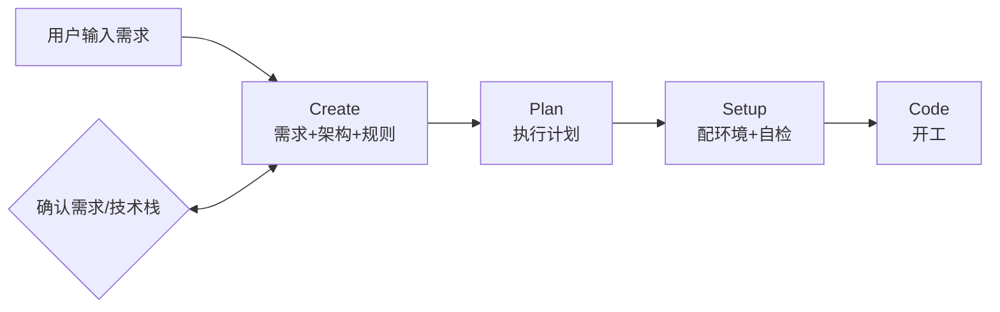

# Antigravity 用户必看：用 Vibe-CLI 一键生成可开工项目（支持 15 章节需求模板）

> **项目地址**：[vibe-coding-flow](https://github.com/wenjie2024/vibe-coding-flow)
> 觉得有用的话，欢迎 Star ⭐

开新项目时，AI IDE 经常一上来就跑偏：
要么环境不对、依赖缺、版本冲突；要么你明明说了"必须用 my_llm_sdk"，它转头就 `import openai`；要么需求和计划散在聊天里，过几轮就丢上下文。

结果就是：你还没开始写功能，就已经在反复解释、反复修环境、反复纠正规则。最耗时间的不是开发，而是"把项目弄到能正常开工"。

**Vibe-CLI** 做的事很简单：把“开工前的准备工作”一次性自动化。
你只需要提供需求（一句话或详细文档），它就生成一个已经准备好的工程：环境搭建指南、环境自检脚本、AI 行为规则、项目上下文/计划都在项目里。打开 Antigravity，就能直接按规矩开工。

接下来说说它解决哪些具体问题、会生成什么、以及怎么用（新增 `--promptfile` 详细模式）。

---

如果你用 Antigravity 这类 AI IDE 写代码，大概率踩过这些坑：

- **环境不一致**：这个项目能跑、那个项目炸；换一台机器又炸
- **规则记不住**：你说"必须用 my_llm_sdk"，AI 一激动又 `import openai`
- **上下文丢失**：需求、架构、计划散落在聊天记录里，AI 只能靠猜
- **开工慢**：每次都要重新解释项目背景、约束、目录规范

**Vibe-CLI 做的事情很简单：**

把你的一句话需求，变成一个"已经准备好的工程"——环境配好、规则写好、计划列好。
打开 IDE 就能直接干活，不用再花一晚上配环境、重复规则。

---

## 它会生成什么？

每次用 Vibe-CLI 创建项目，你会得到这四样东西：

1. **环境搭建指南** (`SETUP_GUIDE_ZH.md`)
   一步步教你把 Conda、SDK、依赖配到位

2. **环境自检脚本** (`preflight.py`)
   一键检测环境是否齐全，"能跑再开工"

3. **AI 行为规则** (`.agent/rules/`)
   强制 AI 遵守项目规范，比如必须走统一的 SDK，不能乱 import

4. **项目记忆库** (`.context/`)
   需求文档、架构文档、当前计划，AI 打开就能看到上下文

---

## 怎么用？三步搞定

### 第一步：安装

```bash
pip install -r requirements.txt
python -m my_llm_sdk.cli init
```

> 依赖中包含 [my-llm-sdk](https://github.com/wenjie2024/my-llm-sdk)，这是一个统一的 LLM 调用层，用于管理多个 Provider 的 API Key 和调用方式。

### 第二步：创建项目 + 生成计划

**方式 A：一句话需求**
```bash
python vibe.py create my-project --prompt "你的想法" --interactive
```

**方式 B：详细需求模板（推荐）**
```bash
python vibe.py create my-project --promptfile requirements.md
```
> 如果 `requirements.md` 不存在，会自动生成包含 15 个章节的需求模板（含背景、目标、边界、验收标准等），填完后重跑即可。

* `--interactive`：推荐加上，用于确认需求和技术栈。
* `python vibe.py plan my-project`：创建后运行，生成第一阶段计划。

### 第三步：配环境 + 自检

```bash
cd my-project
# 按 SETUP_GUIDE_ZH.md 操作
python preflight.py
```

看到全绿就可以开工了。

---

## 标准工作流



1. **Create** — 生成需求文档、架构文档、规则文件、环境指南。过程中会让你确认/修改需求和技术栈
2. **Plan** — 基于需求和架构，生成第一阶段的执行计划 (`activeContext.md`)
3. **Setup** — 按 `SETUP_GUIDE_ZH.md` 配 Conda 环境、装依赖、跑 `preflight.py` 自检
4. **Code** — 打开 IDE，告诉 AI "按 activeContext.md 开始"

```bash
# 简单模式
python vibe.py create my-project --prompt "..." --interactive

# 深度模式（推荐）
python vibe.py create my-project --promptfile requirements.md

python vibe.py plan my-project
cd my-project
python preflight.py
code .
```

---

## 为什么要 preflight.py？

如果不事先检查，你可能刚打开 IDE 就遇到这些问题：

- 依赖缺了 → 模块找不到
- Key 没配 → SDK 报错
- 环境不对 → 版本冲突

然后花半天修环境，还没开始写代码，时间就没了。

`preflight.py` 就是把这些问题**前置**。跑一遍全绿，再开工。

---

## 为什么要 .agent/rules？

AI 在长对话里会忘规则。你说了十遍"用 my_llm_sdk"，它第十一轮可能又忘了。

`.agent/rules/` 里的文件是**写死的约束**：

- 必须用哪个 SDK
- 输出格式是什么
- 不能随便改目录结构

相当于给 AI 立了个"工程规矩"，不是口头说说，是白纸黑字。

---

## 生成的项目长什么样？

```
my-project/
├── .agent/
│   └── rules/                # AI 行为规则
│       ├── 00_project_context.md
│       ├── 00a_project_environment.md
│       ├── 00b_llm_integration.md
│       └── ...
├── .context/                 # 项目记忆库
│   ├── productContext.md     # 需求
│   ├── systemPatterns.md     # 架构
│   ├── activeContext.md      # 当前计划
│   └── project_env.yaml
├── SETUP_GUIDE_ZH.md         # 环境搭建教程
├── preflight.py              # 环境自检脚本
└── README.md
```

---

## 适合谁？

**适合：**
- 经常用 AI 辅助写代码
- 项目需要能交接、能复盘、能持续迭代
- 受够了每次开工都要重新配环境、解释规则

**不太适合：**
- 只是临时写个脚本，用完就丢
- 不想花时间在"规范化"上

---

## 常见问题

**Q: 为什么不直接用模板仓库？**
A: 模板只能给目录结构，不能根据你的需求生成需求文档、架构文档、执行计划。

**Q: 为什么 --interactive 推荐加上？**
A: 很多项目做歪了，不是技术问题，是一开始范围没定清楚。interactive 会问你几个关键问题，避免 AI 自己瞎猜。

---


---

*本项目采用 Apache License 2.0 协议开源。*
